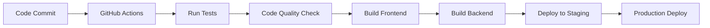

# Delivery & Tooling Summary
## educoreAI Management Reporting Microservice

### Programming Languages & Frameworks

#### Core Technology Stack
- **Backend:** Node.js + Express + JavaScript
- **Frontend:** React + JavaScript + Vite + Tailwind CSS
- **Database:** PostgreSQL (Supabase Cloud)
- **Cache:** Redis (Supabase Cloud)
- **AI Integration:** Gemini AI API
- **Testing:** Jest + Supertest + Playwright (future)

#### Language Specifications
- **Primary Language:** Pure JavaScript (no TypeScript)
- **Node.js Version:** Latest LTS version
- **React Version:** Latest stable version
- **Package Manager:** npm
- **Build Tool:** Vite for frontend development

### Development Environment Setup

#### Development Structure
```
hr-management-reporting/
├── frontend/          # React UI → Deployed to Vercel
├── backend/           # Node.js API → Deployed to Railway
├── database/          # Supabase schema → Hosted on Supabase Cloud
├── docs/              # Project documentation
└── README.md          # Project overview
```

#### Development Modes
- **Local Development:** Day-to-day coding, testing, and debugging
- **Cloud Integration:** Staging and production environments
- **Containerization:** None (standard npm scripts and platform-native builds)

#### Environment Configuration
- **Frontend:** Vite development server with hot reload
- **Backend:** Node.js with nodemon for auto-restart
- **Database:** Supabase local development with cloud sync
- **Cache:** Redis connection to Supabase Cloud

### Tools & Platforms

#### Version Control & Collaboration
- **Git:** Centralized hosting on GitHub
- **Branching Strategy:** Feature branch workflow
- **Main Branches:** `main`, `dev`, `feature/*`
- **Release Management:** GitHub tags for version control
- **Code Reviews:** Pull request-based reviews

#### Development Tools
- **IDE:** Visual Studio Code (VS Code)
- **Extensions:** Git integration, Jest testing, Prettier/ESLint
- **Code Formatting:** Prettier + ESLint for code quality
- **Package Management:** npm for dependencies

#### Testing Framework
- **Unit Testing:** Jest for JavaScript unit tests
- **API Testing:** Supertest for backend endpoint testing
- **E2E Testing:** Playwright (future implementation)
- **Coverage:** Jest coverage reports

#### CI/CD Pipeline
- **Platform:** GitHub Actions
- **Triggers:** Push to main branch, pull requests
- **Process:** Automated testing → Build → Deploy
- **Environments:** Staging and Production

### Build & Delivery Process

#### Build Pipeline


#### Pre-Release Validation
1. **Automated Testing:** Jest + Supertest execution
2. **Code Quality:** ESLint + Prettier validation
3. **Build Verification:** Frontend and backend builds
4. **Integration Testing:** Cross-service communication
5. **Security Scanning:** Dependency vulnerability checks

#### Deployment Targets
- **Frontend:** Vercel (automatic deployment from GitHub)
- **Backend:** Railway (automatic deployment from GitHub)
- **Database:** Supabase Cloud (schema migrations)
- **Staging:** Pre-production testing environment
- **Production:** Live system for executive management

#### Release Management
- **Version Control:** Semantic versioning (v1.0.0)
- **Release Process:** GitHub releases with changelog
- **Rollback Strategy:** Tag-based rollback to stable versions
- **Update Delivery:** Automated deployment on main branch merge

### Collaboration & Workflow

#### Code Review Process
- **Review Requirements:** All code changes require review
- **Review Focus:** Code quality, readability, architecture compliance
- **Approval Process:** Team member approval before merge
- **Review Tools:** GitHub pull request interface

#### Development Workflow
1. **Feature Development:** Create feature branch from `dev`
2. **Local Development:** Code, test, and debug locally
3. **Commit & Push:** Regular commits with descriptive messages
4. **Pull Request:** Submit PR for code review
5. **Review & Approval:** Team review and approval
6. **Merge:** Merge to `dev` branch
7. **Integration Testing:** Automated testing in staging
8. **Production Deploy:** Merge to `main` for production

#### Team Collaboration
- **Communication:** Slack/Discord for daily coordination
- **Documentation:** In-project documentation in `/docs`
- **Decision Making:** Brief documentation of architectural changes
- **Progress Tracking:** GitHub issues and project boards

### Development Environment Setup

#### Local Development Setup
```bash
# Clone repository
git clone <repository-url>
cd hr-management-reporting

# Install dependencies
npm install

# Setup environment variables
cp .env.example .env

# Start development servers
npm run dev:frontend  # Vite dev server
npm run dev:backend   # Node.js with nodemon
npm run dev:database  # Supabase local development
```

#### Environment Variables
```bash
# Backend (.env)
NODE_ENV=development
PORT=3001
SUPABASE_URL=your_supabase_url
SUPABASE_ANON_KEY=your_supabase_key
GEMINI_API_KEY=your_gemini_key
JWT_SECRET=your_jwt_secret

# Frontend (.env)
VITE_API_URL=http://localhost:3001
VITE_SUPABASE_URL=your_supabase_url
VITE_SUPABASE_ANON_KEY=your_supabase_key
```

#### Package.json Scripts
```json
{
  "scripts": {
    "dev": "concurrently \"npm run dev:frontend\" \"npm run dev:backend\"",
    "dev:frontend": "cd frontend && npm run dev",
    "dev:backend": "cd backend && npm run dev",
    "build": "npm run build:frontend && npm run build:backend",
    "build:frontend": "cd frontend && npm run build",
    "build:backend": "cd backend && npm run build",
    "test": "npm run test:frontend && npm run test:backend",
    "test:frontend": "cd frontend && npm test",
    "test:backend": "cd backend && npm test",
    "lint": "npm run lint:frontend && npm run lint:backend",
    "lint:frontend": "cd frontend && npm run lint",
    "lint:backend": "cd backend && npm run lint"
  }
}
```

### CI/CD Configuration

#### GitHub Actions Workflow
```yaml
name: CI/CD Pipeline
on:
  push:
    branches: [main, dev]
  pull_request:
    branches: [main]

jobs:
  test:
    runs-on: ubuntu-latest
    steps:
      - uses: actions/checkout@v3
      - uses: actions/setup-node@v3
        with:
          node-version: '18'
      - run: npm install
      - run: npm run test
      - run: npm run lint

  deploy-staging:
    if: github.ref == 'refs/heads/dev'
    needs: test
    runs-on: ubuntu-latest
    steps:
      - uses: actions/checkout@v3
      - run: npm run build
      - name: Deploy to Staging
        # Deploy to staging environments

  deploy-production:
    if: github.ref == 'refs/heads/main'
    needs: test
    runs-on: ubuntu-latest
    steps:
      - uses: actions/checkout@v3
      - run: npm run build
      - name: Deploy to Production
        # Deploy to production environments
```

### Quality Assurance

#### Code Quality Standards
- **ESLint:** JavaScript linting rules
- **Prettier:** Code formatting
- **Husky:** Git hooks for pre-commit checks
- **Lint-staged:** Run linters on staged files

#### Testing Strategy
- **Unit Tests:** Jest for individual functions and components
- **Integration Tests:** Supertest for API endpoints
- **E2E Tests:** Playwright for user workflows (future)
- **Coverage:** Minimum 80% code coverage

#### Security Measures
- **Dependency Scanning:** Automated vulnerability checks
- **Secret Management:** Environment variables for sensitive data
- **Access Control:** JWT-based authentication
- **Audit Logging:** All actions logged for compliance

### Monitoring & Maintenance

#### Performance Monitoring
- **Application Monitoring:** Built-in platform monitoring
- **Error Tracking:** Automated error reporting
- **Performance Metrics:** Response times and throughput
- **Health Checks:** Service availability monitoring

#### Maintenance Procedures
- **Regular Updates:** Dependency updates and security patches
- **Backup Strategy:** Automated database backups
- **Disaster Recovery:** Rollback procedures and data recovery
- **Documentation:** Keep documentation up-to-date

### Development Best Practices

#### Code Standards
- **Naming Conventions:** camelCase for variables, PascalCase for components
- **File Organization:** Feature-based folder structure
- **Comment Standards:** JSDoc for functions and classes
- **Git Conventions:** Conventional commit messages

#### Development Guidelines
- **Feature Development:** Small, focused commits
- **Testing:** Write tests before implementing features
- **Documentation:** Update README and docs with changes
- **Code Review:** Thorough review of all changes

---
*This Delivery & Tooling Summary provides the complete development environment setup and workflow for the Management Reporting microservice.*

